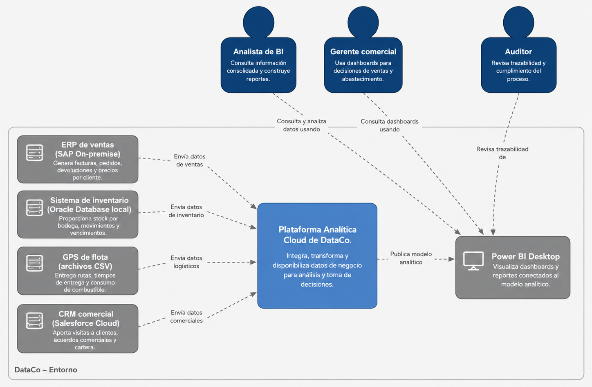
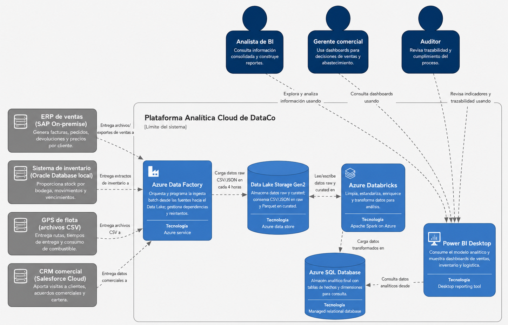
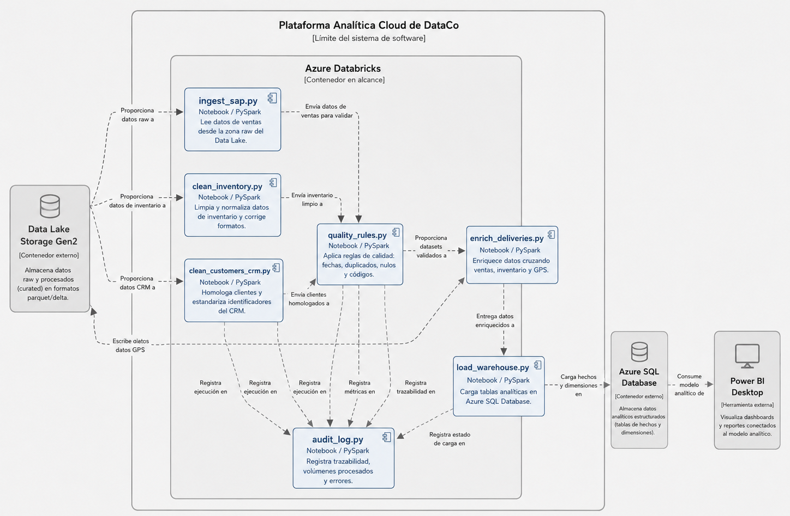

# Pipeline de Datos en la Nube - Caso DataCo 
*Integrantes:* 
- Juan Pablo Gallego Valencia  
- Yeferson Grajales  
- Fredy Alberto Licona Mena  
- Manuela Valencia

DataCo es una empresa colombiana dedicada a la distribución de productos de consumo masivo, con operaciones en 12 departamentos del país y más de 9.000 puntos de venta activos entre supermercados, tiendas y droguerías.

La compañía cuenta con aproximadamente:

- 1.800 empleados
- 320 vehículos de distribución
- Tres líneas principales de negocio:
  - Alimentos perecederos
  - Productos de aseo
  - Cosméticos y cuidado personal

Debido al crecimiento de la operación, DataCo ha desarrollado múltiples sistemas independientes para administrar ventas, inventario, logística y relaciones comerciales.

Actualmente la organización opera sobre cuatro sistemas principales:

| Sistema | Tecnología | Función |
|---|---|---|
| ERP de ventas | SAP On-Premise | Facturación y ventas |
| Inventario | Oracle Database | Stock y movimientos |
| GPS flota | Archivos CSV | Rutas y entregas |
| CRM comercial | Salesforce | Clientes y acuerdos |

# Problemática Identificada

La arquitectura tecnológica actual presenta una alta fragmentación de información, debido a que los sistemas operan de manera aislada y sin integración automática.

Esto genera múltiples problemas operativos y estratégicos para la organización.

---

## 1. Procesos manuales de consolidación

El equipo de inteligencia de negocio debe exportar manualmente información desde múltiples plataformas y consolidarla en archivos Excel.

Este proceso tarda entre 3 y 5 días hábiles para generar reportes ejecutivos.

### Impactos

- Retrasos en reportes
- Baja productividad
- Dependencia manual
- Riesgo de errores humanos

---

## 2. Información desactualizada

Los datos de inventario pueden presentar hasta 72 horas de retraso respecto a la operación real.

Esto provoca:

- Quiebres de stock
- Sobreinventario
- Pérdidas económicas
- Mala planeación logística

---

## 3. Inconsistencia de datos

Los productos y clientes presentan diferencias entre sistemas.

Ejemplos:

- Clientes registrados con nombres distintos
- Productos con códigos diferentes
- Formatos inconsistentes de fechas

### Consecuencias

- Dificultad para generar reportes unificados
- Errores analíticos
- Información poco confiable

---

## 4. Falta de trazabilidad logística

No existe una correlación automática entre:

- Facturas SAP
- Entregas GPS
- Rutas comerciales
- Cumplimiento logístico

Esto impide medir:

- Tiempo real de entrega
- Cumplimiento por vendedor
- Eficiencia de rutas

---
## 5. Problemas de escalabilidad

El procesamiento actual depende de un servidor Windows Server 2012 con capacidad limitada.

Durante temporadas de alta demanda:

- Los reportes tardan hasta 8 horas
- El sistema presenta degradación de rendimiento
- Existen riesgos de indisponibilidad

---

## 1. Drivers Funcionales

| Driver | Descripción | Impacto en la arquitectura |
|---|---|---|
| Automatización del pipeline | Evitar procesos manuales en Excel | Se necesita orquestación con Azure Data Factory |
| Limpieza de datos | Corregir duplicados, fechas y códigos inconsistentes | Se requiere procesamiento con Databricks |
| Modelo de datos consolidado | Unificar ventas, inventario, logística y CRM | Se requiere almacén analítico en Azure SQL |
| Visualización de información | Crear dashboards ejecutivos | Se utiliza Power BI Desktop conectado a Azure SQL |

---

## 2. Drivers No Funcionales

| Driver | Descripción | Impacto en la arquitectura |
|---|---|---|
| Escalabilidad | Procesar hasta 5 millones de registros por ejecución | Uso de servicios cloud escalables |
| Disponibilidad de datos | Datos disponibles con máximo 4 horas de rezago | Pipeline programado cada 4 horas |
| Calidad de datos | Lograr más del 98% de registros limpios | Reglas de validación y transformación |
| Tolerancia a fallos | Si una fuente falla, las demás deben procesarse | Pipelines desacoplados por fuente |
| Seguridad | Proteger precios y márgenes por cliente | Control de acceso por roles |
| Trazabilidad | Auditar cada transformación aplicada | Registro de logs y evidencias |
| Bajo costo | No superar USD 80 mensuales en piloto | Uso de Free Tier y Community Edition |
| Mantenibilidad | Equipo con SQL y Python básico | Arquitectura sencilla y documentada |

---

## 3. Restricciones Arquitectónicas

| Restricción | Descripción | Decisión asociada |
|---|---|---|
| Presupuesto limitado | El piloto no debe superar USD 80 mensuales | Servicios Free Tier y bajo consumo |
| SAP sin API REST | SAP solo puede integrarse por archivos CSV/JSON | Ingesta batch mediante archivos |
| Equipo sin experiencia en Spark | Analistas con SQL y Python básico | Uso guiado de notebooks Databricks |
| Power BI ya licenciado | No se pueden proponer herramientas BI pagas | Uso de Power BI Desktop |
| Datos sensibles | Existen precios y márgenes por cliente | Seguridad mediante roles |
| Fallos parciales | Una fuente puede fallar sin detener todo | Procesamiento independiente por sistema |

---

## 4. ASR - Requerimientos Arquitectónicamente Significativos

| Código | ASR | Prioridad | Justificación |
|---|---|---|---|
| ASR-01 | Integrar los 4 sistemas fuente | Alta | Es la base para eliminar la fragmentación de datos |
| ASR-02 | Actualizar datos cada máximo 4 horas | Alta | Reduce decisiones basadas en información desactualizada |
| ASR-03 | Alcanzar más del 98% de registros limpios | Alta | Garantiza confiabilidad en reportes ejecutivos |
| ASR-04 | Procesar hasta 5 millones de registros | Alta | Permite soportar cierres de mes y temporadas altas |
| ASR-05 | Garantizar trazabilidad de transformaciones | Media | Facilita auditoría y gobierno de datos |
| ASR-06 | Mantener costos menores a USD 80 | Alta | Condiciona la selección de servicios Azure |
| ASR-07 | Proteger información sensible | Alta | Requiere control de acceso al almacén analítico |
| ASR-08 | Tolerar fallos parciales | Alta | Asegura continuidad del pipeline aunque falle una fuente |

---

## 3. Modelo C4

Para el diseño de esta solución, se adopta el modelo de abstracción C4 con el fin de detallar la arquitectura del sistema de datos en múltiples niveles de profundidad. Este modelo garantiza total coherencia con las arquitecturas de referencia analíticas de Microsoft Azure.

### 3.1 Nivel C1: Contexto del Sistema

Este diagrama ilustra el ecosistema de datos de DataCo operando como una caja negra centralizada, delimitando los límites del sistema con respecto a los actores operativos y los orígenes/destinos externos.

#### Documentación de Entidades C1
* **Actores del Negocio:**
  * **Analista de BI:** Consume datos limpios para la construcción de reportes técnicos y tableros operativos.
  * **Gerente Comercial:** Tomador de decisiones estratégicas de negocio basado en indicadores comerciales e inventarios.
  * **Auditor:** Valida el cumplimiento del gobierno de datos interno y la inmutabilidad de los procesos.
* **Sistemas Externos Integrados:**
  * **SAP On-premise (ERP):** Fuente local de órdenes de venta, facturas y maestros de precios.
  * **Oracle Database (Inventario):** Base de datos transaccional con stocks y alertas de caducidad.
  * **GPS de Flota (CSV):** Archivos planos con trazabilidad de rutas y tiempos de despacho.
  * **Salesforce Cloud (CRM):** Plataforma SaaS comercial con datos de cartera y visitas.
  * **Power BI Desktop:** Capa final destinada a la visualización y analítica corporativa.

---

### 3.2 Nivel C2: Contenedores

Este nivel desglosa el pipeline de DataCo exponiendo las tecnologías específicas del stack de Microsoft Azure, sus responsabilidades asignadas, tipos de comunicación y las frecuencias operativas.

---

### 3.3 Nivel C3: Componentes (Boceto y Análisis)

Este diagrama detalla de forma analítica el interior del contenedor de Azure Databricks, modelando el procesamiento lógico distribuido mediante notebooks independientes y acoplados por dependencias secuenciales.

#### Documentación Lógica de Componentes de Procesamiento
1. **`ingest_sap.py`:** Lee la zona `raw/sap/`, aplica limpieza de cabeceras de facturas corruptas, estandariza tipos de datos primitivos y guarda en `curated/sap/` en formato Parquet.
2. **`clean_inventory.py`:** Procesa los datos de Oracle extraídos, elimina filas duplicadas basadas en transacciones de stock y estandariza los formatos de fecha de vencimiento. Guarda en `curated/inventory/`.
3. **`enrich_deliveries.py`:** Toma los archivos CSV de GPS y unifica las estructuras, cruzando las llaves logísticas con los datos limpios de SAP para habilitar la trazabilidad por rutas. Guarda en `curated/logistics/`.
4. **`load_warehouse.py`:** Actúa como el cargador final (Target Loader). Consolida los tres subconjuntos Parquet de la zona Curated y ejecuta sentencias JDBC eficientes para poblar el modelo relacional en Azure SQL Database.